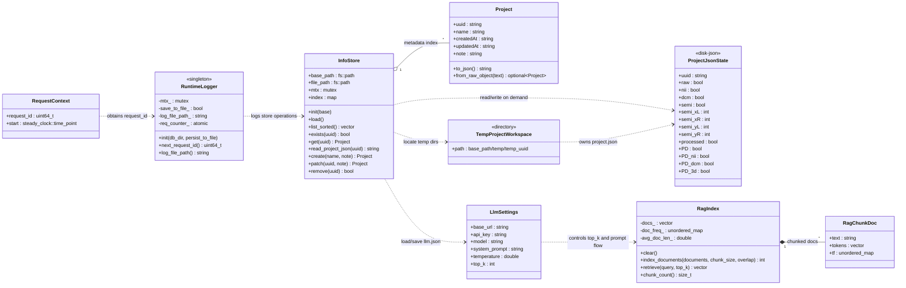

# 内存数据存储结构与概念数据模型

## 1. 结论概览

这个后端的运行期数据模型比较克制，真正长期驻留在内存里的共享状态并不多。

- 核心共享内存状态只有两类：
  - `InfoStore.index`：`uuid -> Project` 的项目元数据索引。
  - `RuntimeLogger` 单例：日志输出配置、日志文件句柄、日志文件路径、请求计数器。
- 请求级短生命周期对象主要有两类：
  - `RequestLogMiddleware::context`：记录单次请求的 `request_id` 与起始时间。
  - `RagIndex`：RAG 问答时临时构建的检索索引，内部包含多个 `RagChunkDoc`。
- 大部分业务状态并不常驻内存，而是以文件系统为真值来源，按需读取：
  - `db/info.json`
  - `db/<uuid>/project.json`
  - `db/temp/<temp_uuid>/project.json`
  - `db/llm.json`
  - `db/llmdb/**`
  - `llm_history.json`、`llmdoc/**`
  - PNG、NPZ、NII、DCM 等影像文件

换句话说，这个系统不是“把项目全量对象树加载进内存”的模式，而是“用轻量索引指向磁盘真值”的模式。

## 2. 运行期数据分层

| 层次 | 对象 | 驻留方式 | 说明 |
| --- | --- | --- | --- |
| 全局共享 | `InfoStore` | 进程常驻 | 保存项目元数据索引，负责 `info.json` 与项目目录的一致性维护。 |
| 全局共享 | `RuntimeLogger` | 进程常驻 | 单例日志器，分配请求 ID，并决定是否写入日志文件。 |
| 请求级 | `RequestLogMiddleware::context` | 单请求临时 | 在请求进入和离开时记录时间与请求编号。 |
| 请求级 | `RagIndex` | 单请求临时 | 问答时把文档切块、分词、计算词频和文档频率。 |
| 轻量实体 | `Project` | `InfoStore.index` 中常驻 | 只保存项目列表页需要的元数据，不含影像处理细节。 |
| 磁盘真值 | `ProjectJsonState` | 按需读取 | `project.json` 记录原始数据、裁剪、处理状态、导出状态等。 |
| 磁盘真值 | `TempProjectWorkspace` | 按需定位 | 临时项目位于 `db/temp/<temp_uuid>`，不进入 `InfoStore.index`。 |
| 配置对象 | `LlmSettings` | 按需读取 | 从 `db/llm.json` 加载，不作为全局缓存长期保存在 `InfoStore` 内。 |

## 3. Mermaid 类图

## 4. 关键解释

### 4.1 `Project` 不是完整项目对象

`Project` 只承担“项目列表元数据”的职责，字段仅包括：

- `uuid`
- `name`
- `createdAt`
- `updatedAt`
- `note`

它不承载以下信息：

- 原始数据是否已导入
- 是否已有 NII 或 DCM 导出
- 半自动裁剪框参数
- 是否完成推理或后处理
- 3D 模型是否生成

这些状态都落在 `project.json` 中，因此类图里把它单独抽象成 `ProjectJsonState`。

### 4.2 `InfoStore.index` 是唯一明确的项目级内存索引

`InfoStore` 内部的：

- `std::map<std::string, Project> index`

就是当前系统最核心的内存数据结构。它的作用是：

- 启动时从 `db/info.json` 加载项目元数据。
- 给列表、详情、删除、更新等接口提供快速索引。
- 在 `create/patch/remove` 后把结果重新持久化回 `db/info.json`。

这意味着：

- 项目元数据是“内存索引 + 磁盘持久化”的双态模型。
- 详细项目状态不是在 `index` 中维护，而是通过 `read_project_json` 或 `update_project_json_fields` 按需访问文件。

### 4.3 临时项目是目录概念，不进入 `InfoStore.index`

临时项目通过：

- `db/temp/<temp_uuid>`

来定位，存在性判断依赖：

- `db/temp/<temp_uuid>/project.json` 是否存在。

也就是说，临时项目没有对应的内存索引表，没有像正式项目那样进入 `std::map`。它更像是“基于目录存在性的轻量工作区对象”。

### 4.4 RAG 的内存索引是瞬时构建的

RAG 相关数据也分两层：

- 持久层：文档文件、解析后的 JSON 或文本缓存、历史问答 JSON。
- 内存层：`RagIndex` 与 `RagChunkDoc`。

`RagIndex` 在一次问答请求中临时创建：

1. 从磁盘加载文档文本。
2. 进行切块。
3. 生成 `tokens` 与 `tf`。
4. 统计 `doc_freq_` 与 `avg_doc_len_`。
5. 按查询临时检索上下文。

请求结束后，这个索引对象就会释放，因此它不是长期缓存。

### 4.5 并发控制依赖 `mutex`，不是无锁缓存

当前关键共享对象都显式使用锁：

- `InfoStore.mtx`：保护 `index` 与持久化流程。
- `RuntimeLogger.mtx_`：保护日志输出与文件句柄。

因此这个系统的并发策略更接近“粗粒度互斥保护的小规模共享状态”，而不是“高并发读写缓存”。

## 5. 源码对应位置

- `Project` 与 `InfoStore`： [include/info_store.h](include/info_store.h#L19-L361)
- `RuntimeLogger`： [include/runtime_logger.h](include/runtime_logger.h#L16-L186)
- `RequestLogMiddleware::context`： [include/request_log_middleware.h](include/request_log_middleware.h#L10-L86)
- `TempProjectWorkspace` 相关路径函数： [include/info_api.h](include/info_api.h#L257-L305)
- `LlmSettings`、`RagChunkDoc`、`RagIndex`： [include/info_api.h](include/info_api.h#L2702-L2931)
- `LlmSettings` 的加载与保存： [include/info_api.h](include/info_api.h#L3827-L3867)
- 项目级 LLM 文档与历史路径： [include/info_api.h](include/info_api.h#L3466-L3498)
- Temp 项目 RAG 文档与历史路径： [include/temp_advanced_api.h](include/temp_advanced_api.h#L1-L104)
- 进程启动与 `InfoStore` 装配： [main.cpp](main.cpp#L106-L164)

## 6. 一句话总结

这个仓库的核心内存模型可以概括为：`InfoStore` 维护轻量项目索引，`RuntimeLogger` 维护全局日志状态，`RagIndex` 只在问答请求期间短暂存在，而真正的业务真值主要保存在 `db` 目录下的 JSON 与影像文件中。